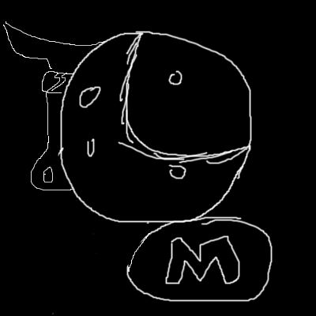

# Milk-Man : Dark Side of the Moo

Milk-Man encounters Dr Morris Ohanian, who he tries to help improve his cheese recipe. But soon he discoveres that Dr Morris is performing some unethical experiments on cheese.

One of these experiments goes wrong and he becomes Dr. MoO. Now he has become very strong, but has become addicted to cheese and must carry a big wheel of cheese to manage his addiction.

Dr. Moo attacks Milk-Man, and abuses his weakness (lactose-intolerance). But Milk-Man uses the power of love and friendship (towards bacteria) and defeats the evil doe

## Characters

- [Milk-Man](./../heroes/milk-man.md)
- [Dr.Moo](./../villains/dr-moo.md)
